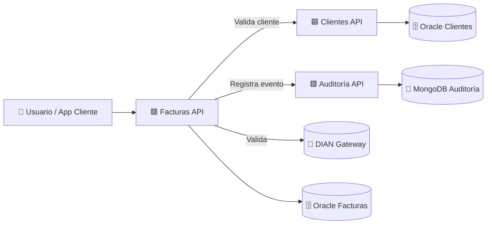

# 🚀 Puesta en marcha rápida

```bash
# 1. Clonar el repositorio
git clone <repo> factumarket
cd factumarket

# 2. Levantar todos los servicios
docker compose up --build

# 3. Ejecutar pruebas de integración
cd facturas && bundle exec rspec spec/integration
cd ../ClientesService && dotnet test ClientesService.Tests/ClientesService.Tests.csproj

# 4. Smoke tests (requiere curl y API_TOKEN configurado en los contenedores)
./smoke_test.sh --clientes http://localhost:5001/health \
                --facturas http://localhost:5002/health \
                --auditoria http://localhost:5003/health
```

## ⚗️ Pruebas manuales rápidas

- Crear factura:
  ```bash
  export API_TOKEN=supersecreto123
  curl -H "Authorization: Bearer $API_TOKEN" \
       -H "Content-Type: application/json" \
       -d '{"cliente_id":123,"monto":4500,"fecha_emision":"2025-10-31"}' \
       http://localhost:5002/facturas
  ```

- Listar facturas:
  ```bash
  curl -H "Authorization: Bearer $API_TOKEN" http://localhost:5002/facturas
  ```

- Registrar evento de auditoría:
  ```bash
  curl -H "Authorization: Bearer $API_TOKEN" \
       -H "Content-Type: application/json" \
       -d '{"servicio":"facturas","entidad_id":"demo","accion":"CREAR","mensaje":"Factura demo"}' \
       http://localhost:5003/events
  ```

- Crear cliente (si usas el `ClientesService` actualizado en el puerto 5001):
  ```bash
  curl -H "Authorization: Bearer $API_TOKEN" \
       -H "Content-Type: application/json" \
       -d '{"nombre":"Carlos","identificacion":"123","correo":"carlos@example.com","direccion":"Bogotá"}' \
       http://localhost:5001/clientes
  ```

---

## 🧠 Visión general

El ecosistema **FactuMarket** se compone de microservicios autónomos que colaboran para gestionar clientes, emitir facturas y registrar auditoría tributaria. Cada servicio aplica principios de Clean Architecture, expone APIs REST y mantiene su propia base de datos.

## 1️⃣ Microservicios principales

| Microservicio | Descripción | Tecnología |
|---------------|-------------|------------|
| **Clientes** | CRUD de clientes; fuente maestra de información. | .NET 8 (C#), Oracle |
| **Facturas** | Emisión y validación DIAN (mock), almacenamiento de respuesta y notificaciones. | Ruby 3.3 (Sinatra), Oracle |
| **Auditoría** | Registro de eventos y logs del ecosistema. | Ruby 3.3 (Sinatra), MongoDB |

## 2️⃣ Flujo de interacción

1. `Facturas` valida el cliente vía API `Clientes`.
2. Guarda la factura y registra un evento Outbox en la misma transacción.
3. Envía la factura a la DIAN (mock), almacena la respuesta y registra auditoría `VALIDAR`.
4. El Relay Outbox reenvía eventos pendientes a Auditoría y correo.

## 3️⃣ Persistencia y consistencia

| Recurso | Motor | Característica |
|---------|-------|----------------|
| Clientes | Oracle | ACID fuerte para datos maestros. |
| Facturas | Oracle | Transacciones con respuesta DIAN incluida. |
| Auditoría | MongoDB | Flexibilidad para eventos y logs. |

- **ACID local** en Oracle para clientes y facturas.
- **Consistencia eventual** mediante Outbox + Relay (`RelayOutboxWorker`).
- **UUIDv7** para trazabilidad global en facturas y eventos.

## 4️⃣ Principios de diseño

- **Microservicios**: despliegues independientes, comunicación REST.
- **Clean Architecture**: dominio puro (`Factura`, `Cliente`, `Evento`); casos de uso (`CrearFactura`, `RegistrarEvento`); infraestructura como adaptadora (ORM, HTTP, gateways DIAN/correo).
- **MVC en la API**: controladores REST, modelos y vistas JSON bien definidas.

## 5️⃣ Diagrama de arquitectura



## 📂 Documentación adicional

- `docs/arquitectura.mmd` – diagrama Mermaid editable.
- `docs/escalabilidad.mmd` – consideraciones de escalabilidad y tolerancia a fallos.
- `smoke_test.sh` – pruebas de humo post-deploy.

---

## 🧾 Validación y Respuesta de la DIAN

Cada factura se valida contra el gateway de la DIAN (mock). La respuesta se almacena dentro del mismo registro de la factura, garantizando trazabilidad tributaria.

| Campo | Descripción |
|-------|-------------|
| `dian_status` | Estado retornado por la DIAN (`ACEPTADO`, `RECHAZADO`, etc.) |
| `dian_uuid` | Identificador único asignado por la DIAN |
| `dian_response` | Respuesta completa serializada en JSON |
| `fecha_validacion_dian` | Fecha/hora en que se validó la factura |

## 🧮 Consistencia y Patrón Outbox (ACID Distribuido)

Para garantizar atomicidad local y consistencia eventual, **Facturas** usa el patrón Outbox:

- La factura y el evento externo se guardan en la misma transacción usando la tabla `outbox_events`.
- Un worker (`RelayOutboxWorker`) reenvía los eventos pendientes hacia Auditoría y Notificaciones, marcando `processed` o `failed` para reintentos.
- El script `bin/relay_runner.rb` ejecuta el relay (ideal como sidecar o cron). Todos los identificadores usan UUIDv7, facilitando trazabilidad global entre servicios.

```text
Factura creada (UUIDv7)
 ├── Guardada en DB (atomicidad local)
 ├── Evento Outbox registrado
 ├── Relay envía a Auditoría/Correo
 └── Auditoría confirma → sistema consistente
```

## 🕒 Relay Runner (Procesamiento en Segundo Plano)

El componente `Relay Runner` mantiene el outbox procesado en segundo plano mediante **rufus-scheduler**. Ejecuta `RelayOutboxWorker` cada 30 segundos, registra logs de ejecución y reintenta eventos en estado `failed`, asegurando consistencia eventual.

- Puede correrse como sidecar (`docker compose up relay-worker`), servicio background local o tarea programada en AWS ECS.
- Requiere la variable `AUDITORIA_URL` y acceso a la base de datos.

```bash
docker compose up relay-worker
```

## 🧩 Seguridad y Autenticación

FactuMarket implementa autenticación basada en **Bearer Token** para proteger los endpoints críticos. El token se define en `API_TOKEN` y el middleware lo valida en todos los servicios excepto `/health`.

```bash
export API_TOKEN="supersecreto123"
curl -H "Authorization: Bearer $API_TOKEN" http://localhost:5002/facturas
```

## 🧪 Pruebas de Integración End-to-End

Validan el flujo completo: emisión de factura, envío a la DIAN, notificación al cliente y registro de eventos en Auditoría.

```bash
RACK_ENV=test rspec spec/integration
```

## 🔒 Seguridad y Autenticación (Auditoría)

El microservicio **Auditoría** también utiliza autenticación **Bearer Token** para proteger sus endpoints, salvo `/health`.

```bash
export API_TOKEN="supersecreto123"
curl -H "Authorization: Bearer $API_TOKEN" http://localhost:5003/auditoria/1
```
